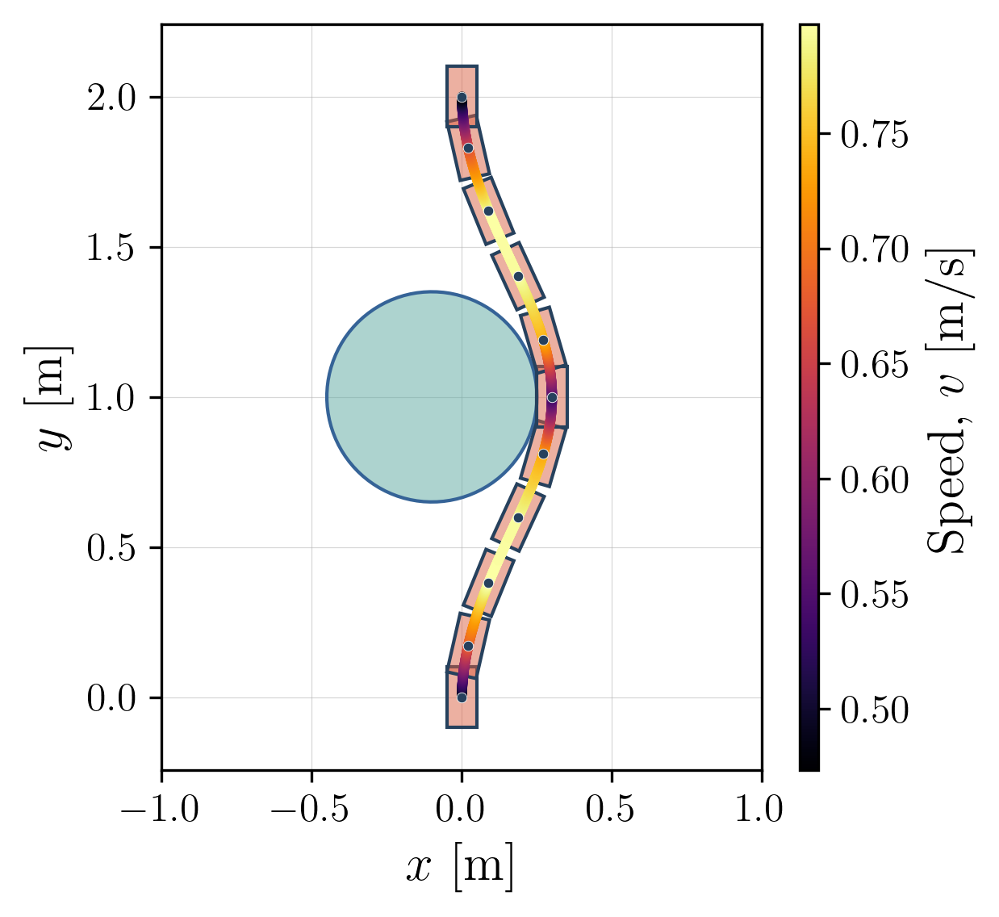
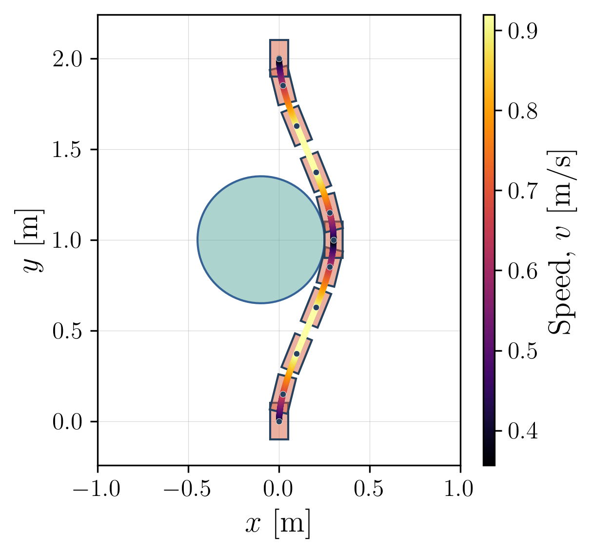

# An Implementation of a Car Trajectory Optimization using Dubin's Dynamic Model (Powered by [SCPToolbox](https://github.com/UW-ACL/SCPToolbox.jl))

## Overview

This repository provides an implementation of the Penalized Trust Region (PTR) and Lossless Convexification (LCvx) methods using SCPToolbox. The implementation is based on the [SCPToolbox tutorial](https://github.com/UW-ACL/SCPToolbox_tutorial).

## Getting Started

### Clone the Repository

```bash
git clone https://github.com/SajjiKazemi/Dubins_car_trajectory_optimization.git
```

## Dependencies
### 1. Using Docker:
Pull the pre-built container from Docker Hub:

```bash
docker-compose pull
```
Start the container:

```bash
docker-compose up -d
```
You should be ready to go.

You can also check my dockerhub out to pull the pre-built image from there utilizing the following command:

```bash
docker pull sajjikazemi/scptoolbox:1.0.0
```

## Some Sample Results
Below is the car's optimized trajectory to navigate around a circular obstacle using the PTR method:


The following trajectory is optimized using the SCvx method:




## Contact
For any questions or feedback, feel free to reach out:

Email: sajjikazemi@uwaterloo.ca

LinkedIn: www.linkedin.com/in/sajjadkazemi
